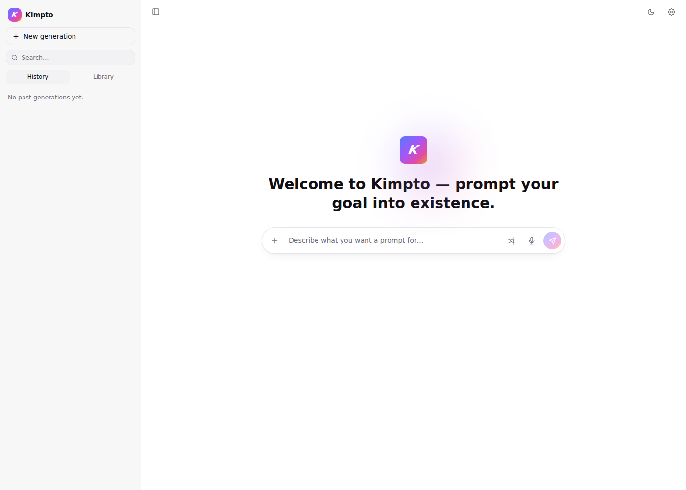
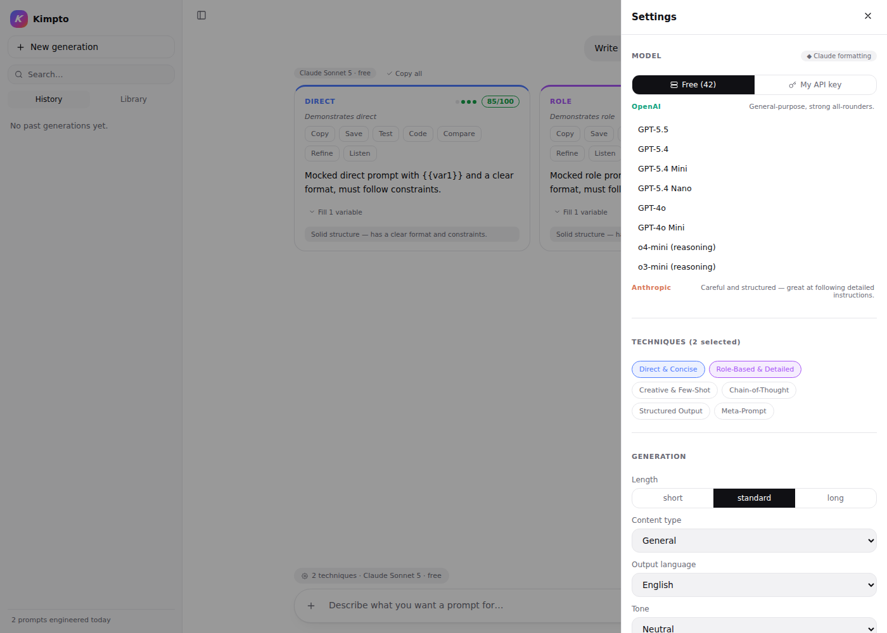
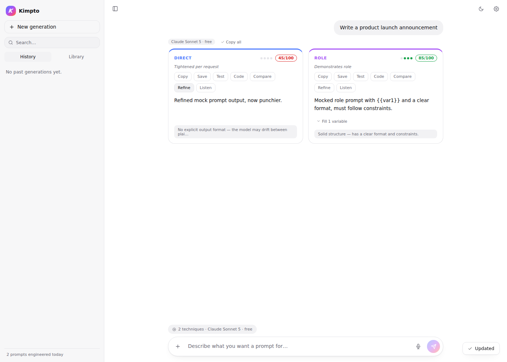
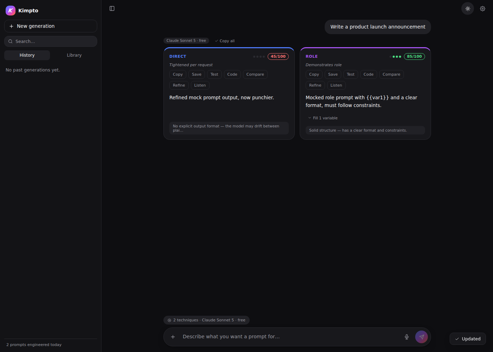

# Kimpto — Prompt Engineering Studio

Kimpto turns a plain-language task description into several genuinely
different, prompt-engineered versions — each grounded in a real,
documented prompt-engineering technique — scores each one, lets you test
it against a real model before you commit to it, and remembers everything
in your own browser.

This is the Flask rebuild: a real Python backend, server-rendered HTML,
hand-written CSS, and vanilla JavaScript on the frontend — no build step,
no bundler, no framework lock-in.



---

## Table of contents

- [What Kimpto does](#what-kimpto-does)
- [Screenshots](#screenshots)
- [Architecture](#architecture)
- [Project structure](#project-structure)
- [Requirements](#requirements)
- [Quickstart](#quickstart)
- [Running it from your desktop](#running-it-from-your-desktop)
- [Environment variables](#environment-variables)
- [Testing](#testing)
- [API reference](#api-reference)
- [The technique library](#the-technique-library)
- [Model-specific formatting conventions](#model-specific-formatting-conventions)
- [The free model catalog](#the-free-model-catalog)
- [Bring your own key](#bring-your-own-key)
- [Putting the code on GitHub](#putting-the-code-on-github)
- [Deploying the live app](#deploying-the-live-app)
- [Why not GitHub Pages?](#why-not-github-pages)
- [Security notes](#security-notes)
- [Browser support](#browser-support)
- [Known limitations & roadmap](#known-limitations--roadmap)
- [Credits & research this is grounded in](#credits--research-this-is-grounded-in)
- [License](#license)

---

## What Kimpto does

1. You describe a task once — "Summarize long customer support tickets
   into a 3-bullet action list for my team lead."
2. You pick which prompt-engineering **techniques** to generate (Direct &
   Concise, Role-Based & Detailed, Creative & Few-Shot, Chain-of-Thought,
   Structured Output, Meta-Prompt) and which **model** you're writing for
   (Claude, GPT, Gemini, or 40+ other free models) in Settings.
3. Kimpto generates one genuinely different prompt per technique,
   formatted using that model vendor's own documented conventions —
   Claude gets XML-tagged sections, GPT gets Markdown-delimited sections,
   Gemini gets the PTCF (Persona/Task/Context/Format) pattern.
4. Every generated prompt is instantly, freely scored by a heuristic
   linter (does it specify a format? hard constraints? a persona? is it
   long enough to not be vague?) — no model call needed for this part.
5. You can **Test** any version against a real model with a sample input
   before you trust it, **Refine** it with a plain-language instruction
   ("make it shorter", "add a persona") instead of just re-rolling,
   **Compare** two versions with a word-level diff, **Save** it to a
   tagged library, or **Copy** it as plain text or a ready-to-run Python
   snippet.
6. You can dictate the task by voice and have any generated prompt read
   back to you — both via the browser's native Web Speech API, no
   extra service required.

Two ways to actually generate text:

- **Free** — routed through [Puter.js](https://developer.puter.com),
  which gives keyless, unlimited-feeling access to 40+ models across
  OpenAI, Anthropic, Google, xAI, DeepSeek, Meta, Mistral, Qwen, and more,
  directly from the browser. No signup, no key, no server involvement.
- **Bring your own key** — pick Claude, GPT, or Gemini, paste your own
  API key, and generation is proxied through this app's Flask backend
  using each vendor's official Python SDK.

## Screenshots

| | |
|---|---|
|  |  |
| Settings: 42+ free models grouped by provider, or bring your own key | A refined prompt mid-thread, with score, checklist dots, and actions |
|  | |
| Dark mode shares the same gradient identity | |

## Architecture

```
Browser                                   Flask backend
┌─────────────────────────────┐           ┌──────────────────────────────┐
│ templates/index.html         │  GET /    │ routes/views.py               │
│ static/css/styles.css        │◄──────────┤ routes/api.py                 │
│ static/js/*.js (ES modules)  │           │ services/prompt_engine.py     │
│                               │  /api/... │ services/linter.py            │
│  Free tier ───────────────┐  │◄─────────►│ services/models_catalog.py    │
│  │ Puter.js (CDN, browser) │  │           │ services/providers.py         │
│  └─────────────────────────┘  │           │  (anthropic / openai /        │
│  BYOK tier ─────────────────┼──┼──────────►   google-genai SDKs)          │
└─────────────────────────────┘           └──────────────────────────────┘
```

The split exists for a real architectural reason, not convenience:
Puter.js's free, keyless access is tied to an anonymous **browser**
session — it cannot be called from a Python process. So **free-tier
generation happens entirely client-side**, calling Puter.js directly.
**Bring-your-own-key generation happens server-side**, because that's
where it's safe to hold a real API key for the lifetime of one request
and call each vendor's official SDK.

Both paths need identical technique wording and identical vendor
formatting conventions, so rather than hand-duplicating that text in two
languages, **Python is the single source of truth**:
`kimpto/services/prompt_engine.py` defines the six techniques and the
model-specific conventions once. The browser fetches them at load time
from `GET /api/techniques` and `GET /api/models` and formats the same
template strings client-side for the free-tier path. If you ever want to
add a seventh technique or change how the Claude convention is worded,
there is exactly one file to edit.

## Project structure

```
kimpto-flask/
├── app.py                        # WSGI entrypoint (python app.py / gunicorn app:app)
├── requirements.txt
├── Procfile                      # for Render / Railway / Heroku-style platforms
├── run.sh / run.bat               # desktop launchers (see below)
├── .env.example
├── .gitignore
├── LICENSE
├── conftest.py                    # empty — puts the project root on pytest's sys.path
├── kimpto/
│   ├── __init__.py                # Flask application factory (create_app)
│   ├── routes/
│   │   ├── views.py               # GET /  → renders templates/index.html
│   │   └── api.py                 # /api/techniques, /api/models, /api/lint,
│   │                               #   /api/generate, /api/refine, /api/test-run
│   ├── services/
│   │   ├── prompt_engine.py       # technique catalog + prompt assembly (the source of truth)
│   │   ├── linter.py              # heuristic prompt-quality scoring
│   │   ├── models_catalog.py      # 42+ free models + BYOK provider/model lists
│   │   └── providers.py           # Anthropic / OpenAI / Google SDK wrappers (BYOK only)
│   ├── templates/
│   │   ├── base.html
│   │   └── index.html
│   └── static/
│       ├── css/styles.css
│       ├── js/
│       │   ├── main.js            # app state + event wiring
│       │   ├── ui.js              # all DOM rendering
│       │   ├── api.js             # generate/refine/test-run dispatcher (Puter vs Flask)
│       │   ├── catalog.js         # fetches + mirrors prompt_engine.py client-side
│       │   ├── voice.js           # Web Speech API (input + output)
│       │   ├── storage.js         # localStorage persistence
│       │   ├── dom.js             # tiny hyperscript-style DOM builder
│       │   └── icons.js           # inline SVG icon set
│       ├── icons/                 # PWA icons
│       ├── manifest.webmanifest
│       └── service-worker.js      # offline app-shell caching
├── tests/
│   ├── test_prompt_engine.py
│   ├── test_linter.py
│   └── test_routes.py
└── docs/screenshots/
```

## Requirements

- **Python 3.10+** (uses `dataclass`, `X | None` type hints, `dict[str, ...]`)
- A modern browser. Voice input (dictation) needs a Chromium-based browser
  (Chrome, Edge, Brave, Arc) — Firefox and Safari don't implement
  `SpeechRecognition` yet. Voice output (read-aloud) works broadly.
- No database, no Node.js, no build step.

## Quickstart

```bash
git clone <your-repo-url> kimpto
cd kimpto

python3 -m venv .venv
source .venv/bin/activate        # Windows: .venv\Scripts\activate

pip install -r requirements.txt

python app.py
```

Then open **http://127.0.0.1:5000**. That's it — the free tier works
immediately with no configuration; bring-your-own-key providers just need
a key pasted into Settings whenever you want to use them.

If you only ever plan to use the free tier and want a lighter install,
you can trim `anthropic`, `openai`, and `google-genai` out of
`requirements.txt` — the app still runs fine and those routes just return
a clear error instead of a stack trace if someone tries to use bring-your-
own-key without the corresponding package installed.

## Running it from your desktop

Two double-clickable launchers are included so you don't need to
remember any commands day-to-day:

- **macOS / Linux: `run.sh`**
  ```bash
  chmod +x run.sh      # once
  ./run.sh
  ```
  On first run it creates a `.venv`, installs dependencies, starts the
  server, and opens your browser to it automatically. To get a real
  desktop icon: on macOS, right-click `run.sh` → *Make Alias*, drag the
  alias to your desktop; on Linux, create a `.desktop` file or a symlink
  (`ln -s /full/path/to/run.sh ~/Desktop/Kimpto`) and mark it executable.

- **Windows: `run.bat`**
  Double-click it directly, or right-click → *Send to* → *Desktop (create
  shortcut)* to get a proper desktop icon. It does the same setup dance
  (venv, install, launch, open browser).

Both scripts are idempotent — running them again just reuses the existing
virtual environment and (re)starts the server, so they're safe as a
permanent "open Kimpto" shortcut.

## Environment variables

See `.env.example`. In short:

| Variable | Default | Purpose |
|---|---|---|
| `SECRET_KEY` | `dev-secret-change-me` | Flask session signing key. Change it for anything beyond local use. |
| `PORT` | `5000` | Port the dev server binds to. Most hosting platforms set this for you. |
| `FLASK_DEBUG` | `1` | `1` for the auto-reloader + debugger locally, `0` anywhere else. |

Nothing else is required. **Bring-your-own-key API keys are never read
from environment variables** — they're entered in the Settings panel by
whoever is using the app, sent with that one request, and never stored
server-side. See [Security notes](#security-notes).

## Testing

```bash
pip install -r requirements-dev.txt   # adds pytest on top of the runtime deps
python -m pytest -q
```

28 tests cover:

- `tests/test_prompt_engine.py` — every technique produces its expected
  instruction text, length settings change the target word count,
  formatting conventions are applied correctly, `extract_json` correctly
  recovers JSON from a model response even through markdown fences or
  leading/trailing prose.
- `tests/test_linter.py` — score bounds, that structure (persona/format/
  constraints) is rewarded and vague hedge language is penalized.
- `tests/test_routes.py` — every route via Flask's test client, including
  that bad input produces clean `400`s and a bad or missing API key
  produces a clean `400`/`502` rather than an unhandled `500`.

No API keys or network access are needed to run the suite.

## API reference

All request/response bodies are JSON. None of these routes require
authentication — this app has no user accounts; bring-your-own-key
requests carry the key with them per-request instead.

### `GET /api/techniques`

Returns the canonical technique catalog (also what the frontend uses to
build free-tier prompts client-side).

```json
{
  "techniques": [
    {
      "id": "direct",
      "label": "Direct & Concise",
      "principle": "RTF pattern",
      "short": "One imperative instruction. Role → Task → Format, nothing else.",
      "instructionTemplate": "Key \"direct\" — ... Hard ceiling of {words} words. ..."
    }
  ]
}
```

### `GET /api/models`

Returns the free model catalog (grouped by provider), the BYOK
provider/model lists, and the convention metadata (mark + label per
vendor).

### `POST /api/lint`

```json
// request
{ "text": "You are an expert. Respond in JSON, under 50 words." }
// response
{ "score": 90, "wordCount": 10, "tips": ["..."], "checks": {"format": true, "constraints": true, "persona": true, "length": false} }
```

### `POST /api/generate` (bring-your-own-key only)

```json
// request
{
  "task": "Summarize long customer support tickets into a 3-bullet action list",
  "details": { "role": "", "audience": "Team leads", "format": "", "constraints": "" },
  "techniques": ["direct", "role"],
  "settings": { "length": "standard", "tone": "Neutral", "language": "English", "markdown": false, "negativeConstraints": "" },
  "provider": "claude",
  "model": "claude-sonnet-5",
  "apiKey": "sk-..."
}
// response
{
  "results": {
    "direct": { "label": "Direct & Concise", "prompt": "...", "rationale": "...", "lint": { "score": 85, "...": "..." } },
    "role":   { "label": "Role-Based & Detailed", "prompt": "...", "rationale": "...", "lint": { "...": "..." } }
  },
  "convention": "claude"
}
```

Errors are always a clean JSON body with an `error` key and an
appropriate status code — `400` for bad/missing input, `502` if the
provider call itself fails (bad key, rate limit, network error).

### `POST /api/refine` (bring-your-own-key only)

```json
// request
{ "prompt": "current prompt text", "instruction": "make it shorter", "settings": {...}, "provider": "gpt", "model": "gpt-5.5", "apiKey": "sk-..." }
// response
{ "prompt": "revised prompt text", "rationale": "Shortened per request", "lint": { "...": "..." } }
```

### `POST /api/test-run` (bring-your-own-key only)

```json
// request
{ "prompt": "the prompt to try", "input": "a sample user message", "provider": "gemini", "model": "gemini-3.1-pro", "apiKey": "..." }
// response
{ "output": "the model's response" }
```

Free-tier generate/refine/test-run never touch these three routes at
all — they call Puter.js directly from `static/js/api.js`.

## The technique library

Kimpto doesn't generate three arbitrary rewordings of the same idea. Each
technique is a distinct, documented strategy:

| Technique | Principle | What it does |
|---|---|---|
| **Direct & Concise** | Role→Task→Format (RTF) | A single imperative instruction, hard word ceiling, no persona/examples/steps — the fastest usable version. |
| **Role-Based & Detailed** | Persona framing | Assigns an expert persona, a numbered multi-step breakdown, an explicit output format. |
| **Creative & Few-Shot** | Few-shot prompting | Includes a `{{variable}}` placeholder and a worked input→output example. |
| **Chain-of-Thought** | Wei et al., 2022 | Explicitly instructs step-by-step internal reasoning before the final answer, and whether to show or hide that reasoning. |
| **Structured Output** | Schema pinning | Pins the response to an explicit JSON or Markdown schema, written out inline, for reliable downstream parsing. |
| **Meta-Prompt** | Self-refine / Reflexion | Instructs the model to draft, critique its own draft, then output only the refined version. |

All wording lives in `kimpto/services/prompt_engine.py::TECHNIQUES` — that
is the only place to edit it.

## Model-specific formatting conventions

Rather than a single one-size-fits-all format, Kimpto structures every
generated prompt according to how its target model's own vendor
documents prompting:

- **Claude (Anthropic)** — wraps sections in XML tags
  (`<role>`, `<task>`, `<context>`, `<examples>`, `<format>`,
  `<constraints>`), matching Anthropic's documented guidance that Claude
  reliably parses XML-tagged structure.
- **GPT (OpenAI)** — uses Markdown section headers or triple-quote
  delimited blocks, instructions before context, matching OpenAI's
  documented prompting guide.
- **Gemini (Google)** — uses the **PTCF** pattern (Persona, Task,
  Context, Format) inline, matching Google's documented framework for
  Gemini prompting.
- **Universal** — plain structured prose with no vendor-specific markup,
  used automatically for every other free model (Llama, Mistral,
  DeepSeek, Qwen, Grok, and so on), where no single documented house
  style applies.

Which convention is used is **derived automatically** from whichever
model is selected in Settings — one decision instead of two.

## The free model catalog

42 models across 12 provider families, mirroring the breadth of what
[Puter.js](https://developer.puter.com) exposes keylessly: OpenAI,
Anthropic, Google, xAI, DeepSeek, Meta Llama, Mistral, Qwen, Google
Gemma, Moonshot AI, Z.AI, and Microsoft. The full list lives in
`kimpto/services/models_catalog.py::FREE_MODEL_GROUPS`.

> Exact model availability on Puter's free tier changes as providers
> ship new models — check [docs.puter.com](https://docs.puter.com)
> periodically and update the ids in `models_catalog.py` if any have
> been renamed or retired.

## Bring your own key

Pick a provider (Claude / GPT / Gemini) and model in Settings, paste an
API key, and generation routes through this app's own backend using that
vendor's official Python SDK (`anthropic`, `openai`, or `google-genai`).
Use this when you want a specific paid model, higher rate limits, or
guaranteed provider-side data handling terms rather than Puter's.

The key:

- travels with the request body over HTTPS (once deployed behind TLS —
  see [Deploying](#deploying-the-live-app))
- is used for exactly one outbound call to that provider
- is **never** written to a database, a log line, or disk on the server
- is **never** persisted in the browser's `localStorage` across reloads —
  `static/js/storage.js` deliberately strips it before saving, so you
  re-enter it each session

## Putting the code on GitHub

```bash
cd kimpto
git init
git add .
git commit -m "Initial commit — Kimpto Flask rebuild"
git branch -M main
git remote add origin https://github.com/<your-username>/<your-repo>.git
git push -u origin main
```

`.gitignore` already excludes `.venv/`, `__pycache__/`, and `.env`, so
none of that ends up in the repository.

## Deploying the live app

This is a real Flask application with a Python backend — it needs a host
that can **run Python**, not just serve static files. A few good, free-
tier-friendly options:

### Render (recommended — simplest free option)

1. Push this repo to GitHub (above).
2. On [render.com](https://render.com), **New → Web Service**, connect
   the repo.
3. Build command: `pip install -r requirements.txt`
   Start command: `gunicorn app:app`
4. Set the `SECRET_KEY` environment variable in the dashboard (and any
   others from `.env.example` you want to override).
5. Deploy. Render gives you a `https://your-app.onrender.com` URL.

### Railway

1. [railway.app](https://railway.app) → **New Project → Deploy from GitHub repo**.
2. It auto-detects Python and the `Procfile`. Set `SECRET_KEY` in
   Variables. Deploy.

### PythonAnywhere

Good if you want a long-lived free tier without spin-down. Upload the
repo (or `git clone` from their bash console), create a virtualenv,
`pip install -r requirements.txt`, then point their WSGI config file at
`kimpto.create_app()` following their Flask quickstart.

### Fly.io / a plain VPS

Works too — `gunicorn app:app` behind any process manager, with a
reverse proxy (Caddy/nginx) in front for TLS, is all this app needs. No
Dockerfile is included by default since the platforms above don't need
one, but this app containerizes trivially if you'd rather go that route.

## Why not GitHub Pages?

**GitHub Pages only serves static files — HTML, CSS, and client-side
JavaScript. It cannot execute Python, so it cannot run this Flask
backend, full stop.** This isn't a configuration issue to work around;
it's what GitHub Pages is.

Practically, this only affects the **bring-your-own-key** routes
(`/api/generate`, `/api/refine`, `/api/test-run`) — everything else,
including the entire free tier (Puter.js runs client-side already),
would keep working on a purely static host. If you specifically want a
zero-backend, GitHub-Pages-only deployment, the path is to drop the
Flask BYOK routes and call each provider's API directly from the browser
instead (each of Anthropic, OpenAI, and Google's APIs support
browser-based calls with the right CORS/key setup) — that's a genuine
architectural fork from what's in this repo, not a deployment setting, so
say the word if you'd like that variant built out instead.

## Security notes

- Bring-your-own-key API keys are request-scoped only — see [Bring your
  own key](#bring-your-own-key) above.
- Every route validates its input and returns clean JSON errors
  (`400`/`502`) rather than leaking stack traces; see
  `tests/test_routes.py` for the specific cases covered.
- `kimpto/__init__.py` sets `X-Content-Type-Options: nosniff` and
  `Referrer-Policy: no-referrer` on every response.
- Set a real, random `SECRET_KEY` before deploying anywhere beyond your
  own machine.
- Always deploy behind HTTPS (every platform listed above provides this
  for free) — the bring-your-own-key flow sends an API key in the
  request body, which should never travel over plain HTTP.

## Browser support

| Feature | Requirement |
|---|---|
| Core app (generate, refine, compare, library) | Any modern browser |
| Voice input (dictation) | Chromium-based (Chrome, Edge, Brave, Arc) — `SpeechRecognition` isn't implemented in Firefox or Safari yet |
| Voice output (read-aloud) | Broadly supported (`SpeechSynthesis`) |
| Install as an app / offline shell | Any browser supporting Service Workers + a Web App Manifest |

Everything degrades gracefully — if voice input isn't available, the mic
button is disabled with an explanatory tooltip rather than failing
silently or breaking the page.

## Known limitations & roadmap

- The free-tier model list is a point-in-time snapshot of Puter's
  catalog — worth checking periodically (see
  [The free model catalog](#the-free-model-catalog)).
- History and the saved-prompt library live in `localStorage`, so they're
  per-browser, not synced across devices. Adding optional accounts +
  server-side storage (SQLite to start) is the natural next step if that
  matters to you.
- No automated end-to-end browser tests are checked into the repo yet
  (the backend's 28 pytest tests don't touch the frontend). The frontend
  was validated manually with Playwright during development — see the
  screenshots — but a `tests/e2e/` suite would be a good addition.
- The heuristic linter is intentionally simple pattern-matching, not an
  LLM-as-judge. That's a deliberate trade-off for instant, free feedback;
  an optional "deep check" that spends one model call on a real critique
  would be a reasonable enhancement.

## Credits & research this is grounded in

- [Puter.js](https://developer.puter.com) for free-tier model access.
- Anthropic's prompt engineering documentation (XML tag structuring,
  multishot examples).
- OpenAI's prompt engineering guide (delimiters, instructions-before-
  context).
- Google's Gemini prompting guide (the PTCF framework).
- Wei et al., *"Chain-of-Thought Prompting Elicits Reasoning in Large
  Language Models"* (2022), for the chain-of-thought technique.
- The general self-refine / Reflexion line of work, for the meta-prompt
  technique.

## License

MIT — see [LICENSE](LICENSE).
