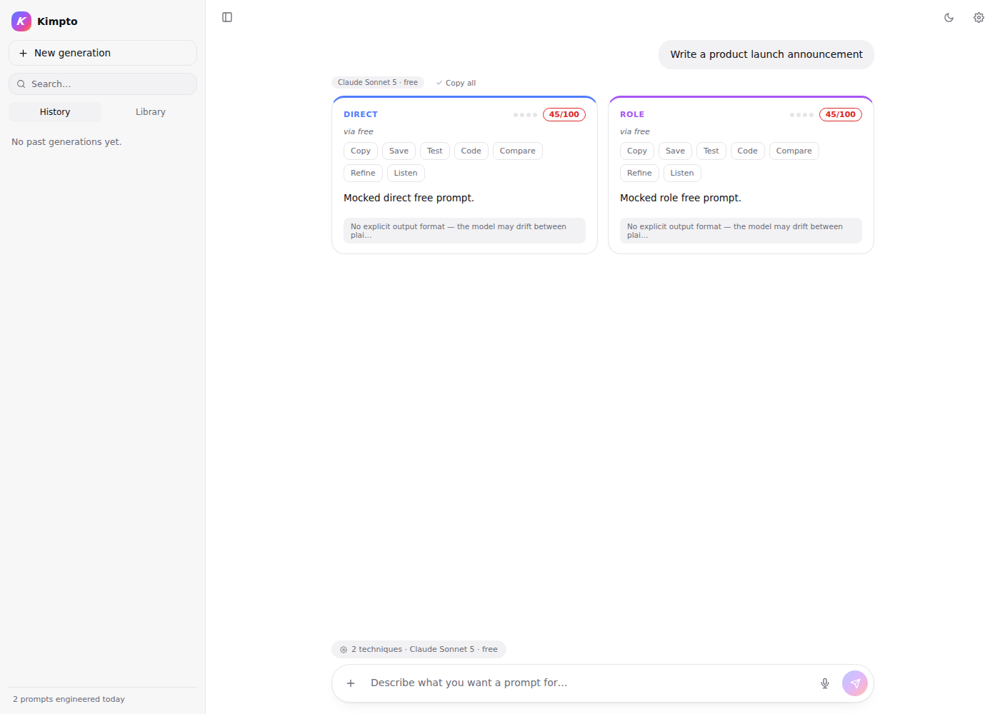
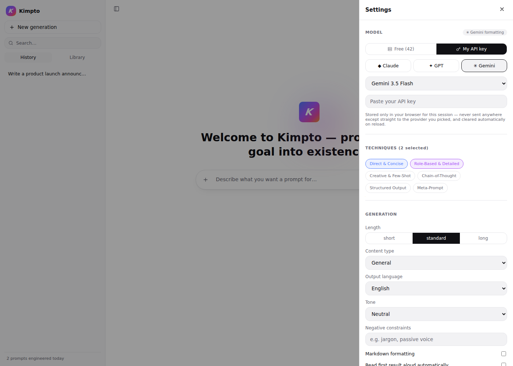
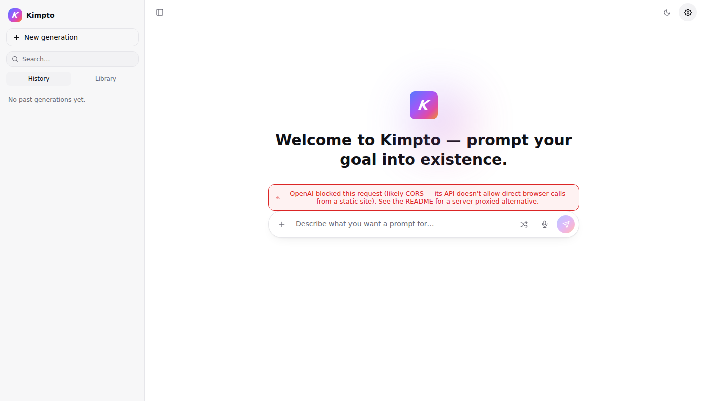

# Kimpto — Prompt Engineering Studio (static build)

Kimpto turns a plain-language task description into several genuinely
different, prompt-engineered versions — each grounded in a real,
documented prompt-engineering technique — scores each one, lets you test
it against a real model before you commit to it, and remembers everything
in your own browser.

This is the **static build**: plain HTML, hand-written CSS, and vanilla
JavaScript ES modules — no backend, no build step, no bundler, no
framework. It's designed to be pushed straight to **GitHub Pages** and
opened from a **Chrome desktop shortcut**, exactly like the very first
version of this project.

> A separate Flask build of Kimpto also exists (real Python backend,
> server-proxied bring-your-own-key calls). Use this static build if you
> want free GitHub Pages hosting and don't need OpenAI's bring-your-own-key
> path to work reliably (see [OpenAI and CORS](#openai-and-cors) below for
> why that one's the exception).



---

## Table of contents

- [What Kimpto does](#what-kimpto-does)
- [Two ways to generate](#two-ways-to-generate)
- [Project structure](#project-structure)
- [Local preview](#local-preview)
- [Hosting it on GitHub Pages](#hosting-it-on-github-pages)
- [Creating a Chrome desktop shortcut](#creating-a-chrome-desktop-shortcut)
- [The technique library](#the-technique-library)
- [Model-specific formatting conventions](#model-specific-formatting-conventions)
- [The free model catalog](#the-free-model-catalog)
- [Bring your own key](#bring-your-own-key)
- [OpenAI and CORS](#openai-and-cors)
- [Why Gemini's bring-your-own-key list is Flash-only](#why-geminis-bring-your-own-key-list-is-flash-only)
- [Data & privacy](#data--privacy)
- [Browser support](#browser-support)
- [If you outgrow the static build](#if-you-outgrow-the-static-build)
- [Credits & research this is grounded in](#credits--research-this-is-grounded-in)
- [License](#license)

---

## What Kimpto does

1. You describe a task once — "Summarize long customer support tickets
   into a 3-bullet action list for my team lead."
2. You pick which prompt-engineering **techniques** to generate (Direct &
   Concise, Role-Based & Detailed, Creative & Few-Shot, Chain-of-Thought,
   Structured Output, Meta-Prompt) and which **model** you're writing for
   — Claude, GPT, Gemini, or 40+ other free models — in Settings.
3. Kimpto generates one genuinely different prompt per technique,
   formatted using that model vendor's own documented conventions —
   Claude gets XML-tagged sections, GPT gets Markdown-delimited sections,
   Gemini gets the PTCF (Persona/Task/Context/Format) pattern.
4. Every generated prompt is instantly, freely scored by a heuristic
   linter (does it specify a format? hard constraints? a persona? is it
   long enough to not be vague?) — no model call needed for this part.
5. You can **Test** any version against a real model with a sample input
   before you trust it, **Refine** it with a plain-language instruction
   ("make it shorter", "add a persona") instead of just re-rolling,
   **Compare** two versions with a word-level diff, **Save** it to a
   tagged library, or **Copy** it as plain text or a ready-to-run Python
   snippet.
6. You can dictate the task by voice and have any generated prompt read
   back to you, both via the browser's native Web Speech API.

## Two ways to generate

- **Free** — routed through [Puter.js](https://developer.puter.com),
  which gives keyless, unlimited-feeling access to 40+ models across
  OpenAI, Anthropic, Google, xAI, DeepSeek, Meta, Mistral, Qwen, and more,
  directly from the browser. No signup, no key.
- **Bring your own key** — pick Claude, GPT, or Gemini in Settings, paste
  your own API key, and this page calls that provider's public API
  **directly from your browser** — there's no server in between at all.
  See [Bring your own key](#bring-your-own-key) for exactly how, and
  [OpenAI and CORS](#openai-and-cors) for the one real limitation of this
  approach.

## Project structure

```
kimpto-static/
├── index.html
├── css/styles.css
├── js/
│   ├── main.js        # app state + event wiring
│   ├── ui.js           # all DOM rendering
│   ├── api.js           # generate/refine/test-run — Puter.js or a direct
│   │                     #   fetch() to whichever provider you picked
│   ├── catalog.js       # technique library + model catalog (inline data —
│   │                     #   this file is now the single source of truth,
│   │                     #   since there's no backend to fetch it from)
│   ├── voice.js          # Web Speech API (input + output)
│   ├── storage.js        # localStorage persistence
│   ├── dom.js             # tiny hyperscript-style DOM builder
│   └── icons.js           # inline SVG icon set
├── icons/                 # PWA icons
├── manifest.webmanifest
├── service-worker.js      # offline app-shell caching
├── serve.sh / serve.bat   # local preview server (see below — required,
│                           #   plain file:// won't work)
├── LICENSE
└── docs/screenshots/
```

Every path in `index.html`, `manifest.webmanifest`, and
`service-worker.js` is **relative**, not absolute — this matters because
GitHub Pages project sites are served from a subpath
(`https://username.github.io/repo-name/`), and an absolute path like
`/css/styles.css` would resolve to the wrong place there.

## Local preview

Kimpto's JavaScript is written as ES modules (`import`/`export`), which
browsers refuse to load over a plain `file://` double-click — that's a
browser security restriction, not a bug here. Preview it over a local
server instead:

```bash
./serve.sh        # macOS / Linux
serve.bat         # Windows (double-click, or run from a terminal)
```

Either opens `http://localhost:8000` in your default browser. Both just
wrap Python's built-in `http.server`, so no dependencies beyond Python 3
(already on macOS/Linux; [python.org](https://www.python.org/downloads/)
on Windows).

## Hosting it on GitHub Pages

```bash
cd kimpto-static
git init
git add .
git commit -m "Initial commit — Kimpto static build"
git branch -M main
git remote add origin https://github.com/<your-username>/<your-repo>.git
git push -u origin main
```

Then on GitHub: **Settings → Pages → Source: Deploy from a branch →
Branch: `main`, folder: `/ (root)` → Save.**

GitHub builds and publishes it at `https://<your-username>.github.io/<your-repo>/`
within a minute or two (check the **Actions** tab for progress on the
first deploy). That's the whole deployment — no build step, no server to
configure, no environment variables to set. Free tier generation works
immediately for anyone who visits that URL; bring-your-own-key works too,
since each visitor's key stays in their own browser and is used only for
their own direct calls to their chosen provider.

## Creating a Chrome desktop shortcut

Once it's live on GitHub Pages (or even while previewing locally):

1. Open the site in Chrome.
2. Click the **install icon** in the address bar (a small monitor-with-
   arrow icon) — it appears automatically because this site ships a web
   app manifest. If you don't see it: click the **⋮** menu → **Cast,
   save, and share** → **Create shortcut…**, and check **"Open as
   window."**
3. Chrome adds a real desktop/dock/taskbar icon (the gradient "K" mark)
   that opens Kimpto in its own app window — no address bar, no tabs,
   just the app, exactly like a native app launcher.

This works the same way whether the shortcut points at your GitHub Pages
URL (recommended, so it's always the latest deployed version) or at
`http://localhost:8000` while you're actively developing.

## The technique library

Kimpto doesn't generate three arbitrary rewordings of the same idea. Each
technique is a distinct, documented strategy:

| Technique | Principle | What it does |
|---|---|---|
| **Direct & Concise** | Role→Task→Format (RTF) | A single imperative instruction, hard word ceiling, no persona/examples/steps — the fastest usable version. |
| **Role-Based & Detailed** | Persona framing | Assigns an expert persona, a numbered multi-step breakdown, an explicit output format. |
| **Creative & Few-Shot** | Few-shot prompting | Includes a `{{variable}}` placeholder and a worked input→output example. |
| **Chain-of-Thought** | Wei et al., 2022 | Explicitly instructs step-by-step internal reasoning before the final answer, and whether to show or hide that reasoning. |
| **Structured Output** | Schema pinning | Pins the response to an explicit JSON or Markdown schema, written out inline, for reliable downstream parsing. |
| **Meta-Prompt** | Self-refine / Reflexion | Instructs the model to draft, critique its own draft, then output only the refined version. |

All wording lives in `js/catalog.js` — that's the only place to edit it.

## Model-specific formatting conventions

Rather than a single one-size-fits-all format, Kimpto structures every
generated prompt according to how its target model's own vendor
documents prompting — **Claude** gets XML-tagged sections
(`<role>`, `<task>`, `<context>`, `<examples>`, `<format>`), **GPT** gets
Markdown section headers or triple-quote delimited blocks, **Gemini**
gets the **PTCF** pattern (Persona, Task, Context, Format) inline, and
every other free model gets plain structured prose with no vendor-
specific markup. Which convention applies is derived automatically from
whichever model is selected in Settings.

## The free model catalog

42 models across 12 provider families, mirroring the breadth of what
[Puter.js](https://developer.puter.com) exposes keylessly: OpenAI,
Anthropic, Google, xAI, DeepSeek, Meta Llama, Mistral, Qwen, Google
Gemma, Moonshot AI, Z.AI, and Microsoft. The full list lives in
`js/catalog.js::FREE_MODEL_GROUPS`.

> Exact model availability on Puter's free tier changes as providers ship
> new models — check [docs.puter.com](https://docs.puter.com)
> periodically and update the ids in `catalog.js` if any have been
> renamed or retired.

## Bring your own key

Pick a provider and model in Settings, paste an API key, and generation
calls that provider's public API **directly from this page** — there is
no backend in this build to route through. Two of the three providers
explicitly support this:

- **Claude (Anthropic)** — via the
  `anthropic-dangerous-direct-browser-access` header, which Anthropic's
  API documents specifically for client-side apps like this one.
- **Gemini (Google AI Studio)** — the Generative Language API sends
  permissive CORS headers and is designed for direct browser use; this is
  the same thing Google's own AI Studio "get code" snippets show.
- **GPT (OpenAI)** — see [OpenAI and CORS](#openai-and-cors) directly
  below; this one doesn't work the same way.



The key:

- travels straight from your browser to the provider's own servers over
  HTTPS (once hosted on GitHub Pages, which serves everything over
  HTTPS automatically)
- never touches this app's code repository, never gets logged anywhere,
  and is never sent to any server Kimpto controls, because **there is no
  such server** in this build
- is **not** persisted in `localStorage` across reloads —
  `js/storage.js` deliberately strips it before saving, so you re-enter
  it each session as a small extra safety margin

## OpenAI and CORS

`api.openai.com` does not send CORS headers permitting requests from
arbitrary browser origins, so a direct `fetch()` to it from a page hosted
on `github.io` (or `localhost`, or anywhere else that isn't OpenAI's own
approved surfaces) is blocked **by the browser itself**, before OpenAI's
servers ever see it. This is a real, structural limitation of doing this
without any backend at all — it isn't a bug in this code, and it isn't
fixable from the frontend alone.

Kimpto still lets you select GPT + bring-your-own-key in Settings and
still attempts the call, because the failure mode is exactly the same
shape as any other provider error (a clear message in the error banner,
nothing crashes) — but expect it to fail on a plain static deploy:



If GPT bring-your-own-key matters to you, the fix is a tiny server-side
proxy for just that one call (any serverless function that adds the
right CORS headers and forwards to OpenAI works) — or use the companion
Flask build of this project, which proxies all three providers server-
side and doesn't hit this limitation at all.

## Why Gemini's bring-your-own-key list is Flash-only

The bring-your-own-key model list for Gemini is deliberately **Flash-tier
only** — Gemini 3.5 Flash, Gemini 3.6 Flash, and Gemini 3.7 Flash — with
no Pro-tier model included. A personal Google AI Studio API key's free
quota is generous for Flash models and far tighter for Pro models, which
are really meant to be used with billing enabled through Vertex AI. If
you want Pro-tier Gemini, the **free tier** (Settings → Free → Google)
still lists it, since that's routed through Puter rather than your own
quota.

## Data & privacy

There is no backend, no database, and no analytics in this build.
Everything Kimpto remembers — session history, your saved-prompt
library, your model choice, generation settings — lives only in
`localStorage` in your own browser, on your own device. Clearing your
browser data clears it. Nothing is synced anywhere, which also means it
doesn't follow you to a different browser or device — see
[If you outgrow the static build](#if-you-outgrow-the-static-build) if
that becomes a problem worth solving.

## Browser support

| Feature | Requirement |
|---|---|
| Core app (generate, refine, compare, library) | Any modern browser |
| Voice input (dictation) | Chromium-based (Chrome, Edge, Brave, Arc) — `SpeechRecognition` isn't implemented in Firefox or Safari yet |
| Voice output (read-aloud) | Broadly supported (`SpeechSynthesis`) |
| Claude / Gemini bring-your-own-key | Any modern browser (both APIs support direct browser calls) |
| GPT bring-your-own-key | Not reliable from a static site — see [OpenAI and CORS](#openai-and-cors) |
| Install as an app / Chrome shortcut | Any browser supporting Service Workers + a Web App Manifest (Chrome, Edge) |

Everything degrades gracefully — if voice input isn't available, the mic
button is disabled with an explanatory tooltip instead of failing
silently.

## If you outgrow the static build

A few things this build intentionally doesn't do, because they need a
real backend:

- **GPT bring-your-own-key that actually works** (see above).
- **History/library synced across devices** — this build is
  per-browser/per-device by design (see [Data & privacy](#data--privacy)).
- **Hiding a shared API key from end users** — if you ever want to run
  Kimpto for other people using *your* key rather than having each
  person bring their own, that key can't safely live in browser-visible
  JavaScript at all; it needs a server.

The companion **Flask build** of this project solves all three (a real
Python backend, server-proxied calls for all providers, the same
frontend design) at the cost of needing a host that runs Python —
GitHub Pages can't do that part. Ask for that zip if any of the above
starts to matter.

## Credits & research this is grounded in

- [Puter.js](https://developer.puter.com) for free-tier model access.
- Anthropic's prompt engineering documentation (XML tag structuring,
  multishot examples, and the documented direct-browser-access header).
- OpenAI's prompt engineering guide (delimiters, instructions-before-
  context).
- Google's Gemini prompting guide (the PTCF framework) and AI Studio's
  documented support for direct browser calls.
- Wei et al., *"Chain-of-Thought Prompting Elicits Reasoning in Large
  Language Models"* (2022), for the chain-of-thought technique.
- The general self-refine / Reflexion line of work, for the meta-prompt
  technique.

## License

MIT — see [LICENSE](LICENSE).
